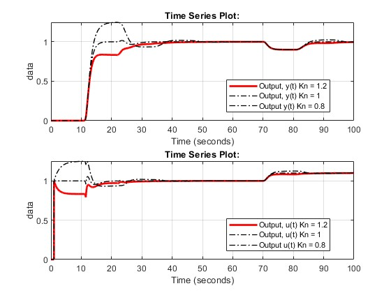
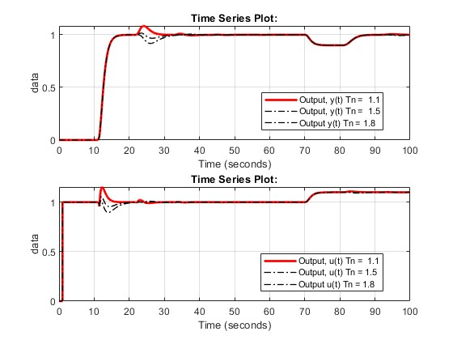
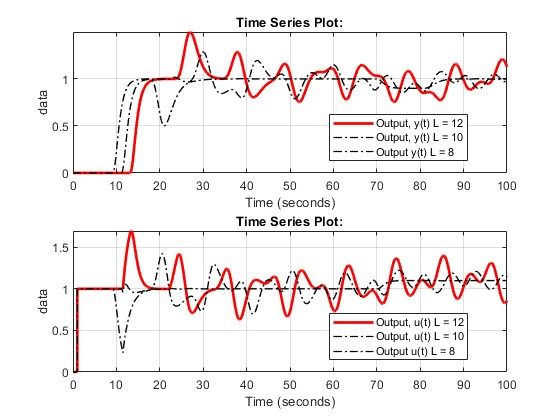

This simulations are showing there a 20% error in time constant or gain of our plant can still lead to Stable processes, even tho their responses are not as appropriate, but for dead time errors it can lead to unstabilize the plant

Gain error:

Time Constant error:

Dead Time error:

